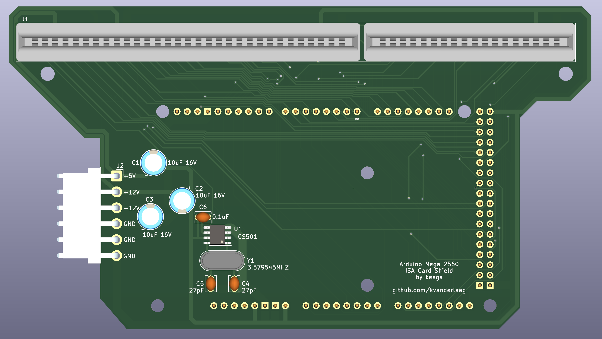
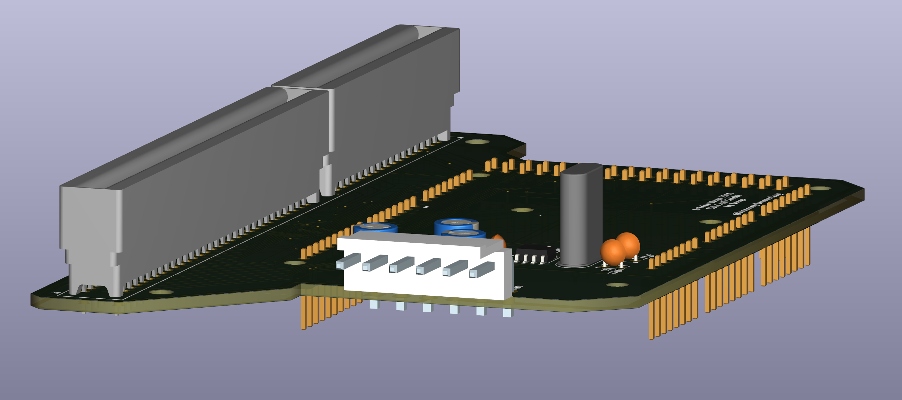

# Arduino Mega 2560 ISA Card Shield
 
 Diagnostic/Development shield for IBM PC XT/AT ISA cards.
 

 
 ## God, now what?
 
 Okay, listen. Sometimes you're developing an ISA card, and you fuck it up. Sometimes you want to be able to give that card a set of known inputs for a bus state, and probe around on the card to see why it's not doing what you expect. If we're being honest, that's usually pretty hard when the card is installed in a machine! Arduinos are easy as hell to write simple firmware for, so this is a shield (in an extremely non-standard form factor, you won't be stacking anything on top of this) that breaks most of the useful ISA signals out to an ISA card slot. Pin assignment is set up so that things generally live on sequential port pins wherever possible, and all of the weird ports that you don't get all of the pins for are set up so that they're grouped by whether they're expected to be driven by the bus master, or the card. (i.e. whether you're going to be reading or writing them from the Arduino.) This _should_ allow for reasonably fast access to setting/reading bus state.
 
 ## Does it suck?

Yes, the Arduino Mega 2560 is an 8MHz 8-bit AVR, it's going to be too slow to keep up with 14.31818 MHz ISA signalling in the strictest sense. This isn't going to be useful as a bus emulator, but for basic poking at cards and testing logic, it will work for a lot of cases.

## What sort of features does it have?

It breaks out the full 16-bit data bus, the full address bus for a 16-bit card, and all of the control signals you should need for both 8 and 16-bit reads and writes. Due to the number of available I/O pins on the arduino, it does only provide a small number of DMA channels and interrupts. Specifically, IRQ 2/9, 3, 5, and 7, and DMA channels 1, 3, 5, and 7. I'm using this mostly to test sound cards, for which these are all reasonable options -- it would probably be a good idea to add a jumper block to switch at least one of these out between the remaining options.

The Renesas clock generator/multiplier on the board produces a 14.31818MHz clock signal on the bus clock pin. If your card is using this pin to clock another part (like a Yamaha FM chip, or an SAA1099 sound generator, for instance), this will supply the correct frequency, but the Arduino won't be able to keep up with it. I'm interested to know how well this works for a variety of applications, so if you use this for anything, let me know!

## What AVR ports map to which ISA signals?

Pins not listed in a port are reserved for system use on the Arduino, so maybe don't read from or write to them.

### Port A

| AVR Pin | ISA Signal |
| --- | --- |
| PA0 | D0 |
| PA1 | D1 |
| PA2 | D2 |
| PA3 | D3 |
| PA4 | D4 |
| PA5 | D5 |
| PA6 | D6 |
| PA7 | D7 |

### Port B

| AVR Pin | ISA Signal |
| --- | --- |
| PB0 | A0 |
| PB1 | A1 |
| PB2 | A2 |
| PB3 | A3 |
| PB4 | A4 |
| PB5 | A5 |
| PB6 | A6 |
| PB7 | A7 |

### Port C

| AVR Pin | ISA Signal |
| --- | --- |
| PC0 | SD8 |
| PC1 | SD9 |
| PC2 | SD10 |
| PC3 | SD11 |
| PC4 | SD12 |
| PC5 | SD13 |
| PC6 | SD14 |
| PC7 | SD15 |

### Port D

| AVR Pin | ISA Signal |
| --- | --- |
| PD0 | A16 |
| PD1 | A17 |
| PD2 | A18 |
| PD3 | A19 |
| PD7 | AEN |

### Port E

| AVR Pin | ISA Signal |
| --- | --- |
| PE0 | RESET |
| PE1 | ALE |
| PE2 | SBHE |
| PE3 | ~MEMR |
| PE5 | ~MEMW |

### Port F

| AVR Pin | ISA Signal |
| --- | --- |
| PF0 | A8 |
| PF1 | A9 |
| PF2 | A10 |
| PF3 | A11 |
| PF4 | A12 |
| PF5 | A13 |
| PF6 | A14 |
| PF7 | A15 |

### Port G

| AVR Pin | ISA Signal |
| --- | --- |
| PG0 | ~IOR |
| PG1 | ~IOW |
| PG2 | ~SMEMR |
| PG5 | ~SMEMW |

### Port H

| AVR Pin | ISA Signal |
| --- | --- |
| PH0 | ~DACK1 |
| PH1 | ~DACK3 |
| PH2 | ~DACK5 |
| PH3 | ~DACK7 |
| PH5 | T/C |
| PH6 | ~IO_RDY |

### Port J

| AVR Pin | ISA Signal |
| --- | --- |
| PJ0 | ~NOWS |
| PJ1 | ~IOCS16 |

### Port K

| AVR Pin | ISA Signal |
| --- | --- |
| PK0 | LA17 |
| PK1 | LA18 |
| PK2 | LA19 |
| PK3 | LA20 |
| PK4 | LA21 |
| PK5 | LA22 |
| PK6 | LA23 |
| PK7 | ~MASTER |

### Port L

| AVR Pin | ISA Signal |
| --- | --- |
| PL0 | DRQ1 |
| PL1 | DRQ3 |
| PL2 | DRQ5 |
| PL3 | DRQ7 |
| PL4 | IRQ2 |
| PL5 | IRQ3 |
| PL6 | IRQ5 |
| PL7 | IRQ7 |

## How do I write firmware for it to access an ISA card?

If you're not sure, this project might not be applicable to your use case. In short, take a look at these pages:
https://www.robots.ox.ac.uk/~adutta/blog/interfacing-with-the-isa-bus.html
http://wearcam.org/ece385/lecture6/isa.htm

and then use the Arduino to read/write the appropriate signals to the mapped ports, appropriate to your card's behaviour.

## What do I need to build it?

Part values are all marked on the board, so there should be no confusion about what goes where. Also the only things that have different values and the same footprint are the 27pf and 0.1uF ceramic capacitor, so as long as you don't fuck that up, you should be fine. Just make sure the pin headers point _downward_.

- 1x ISA card slot, EDAC 395-098-520-350 - https://www.digikey.ca/en/products/detail/edac-inc/395-098-520-350/210780
- 1x 3.579545MHz HC-49/US crystal - https://www.digikey.ca/en/products/detail/raltron-electronics/AS-3-579545-18/10246240
- 1x JST-VH 6-pin male header (I would recommend a right angle) - https://www.digikey.ca/en/products/detail/jst-sales-america-inc/B6PS-VH-LF-SN/926559
- 1x Renesas 501MILFT clock generator - https://www.digikey.ca/en/products/detail/renesas-electronics-america-inc/501MILFT/1915335
- 1x 0.1uF ceramic capcitor, through-hole, 2.50mm pitch - https://www.digikey.ca/en/products/detail/vishay-beyschlag-draloric-bc-components/K104K15X7RF5TL2/286538
- 2x 27pF ceramic capcitor, through-hole, 2.50mm pitch - https://www.digikey.ca/en/products/detail/vishay-beyschlag-draloric-bc-components/K270J15C0GF5TL2/286460
- 3x 10uF 16V electrolytic capacitor, through-hole, radial - https://www.digikey.ca/en/products/detail/panasonic-electronic-components/ECA-1CM100I/2688653
- 1x 2.54mm pin header, 2x18 position - https://www.digikey.ca/en/products/detail/w%C3%BCrth-elektronik/61303621121/4846882
- 1x 2.54mm pin header, 1x10 position - https://www.digikey.ca/en/products/detail/adam-tech/PH1-10-UA/9830653
- 5x 2.54mm pin header, 1x8 position - https://www.digikey.ca/en/products/detail/adam-tech/PH1-08-UA/9830442

- 1x PCB - Gerbers in /gerbil/arduino-mega-isa-shield.zip

Total BOM should be about $30 CAD, plus the board.

I've opted to just mount regular pin headers to the bottom of the board since nothing is stacking through, but you could use long-pinned female receptacles instead if you want to be able to shove jumper wires into things for test leads; I'm not your dad, do what you want.

You probably don't need standoffs for the shield itself, but I've provided two 3.5mm holes for the part that overhangs the Arduino with the ISA card slot on it. M3 brass or nylon non-threaded standoffs approximately 12.5mm in length, plus a couple of M3 machine screws, should give it a bit of rigidity if you've just got it sitting flat on a surface. If you're building a mount for the whole contraption, mount it however you'd like.

## Notes on Power

The shield also expects to supply the card with +5V, +12V, and -12V from the JST-VH connector. (The pinout is marked on the board for when you're building a harness.) You'll probably want some sort of small off-board AC/DC converter, some 16-18awg wire, and a harness to connect the two together. You'll also need a way to connect the power supply to mains, which I am _absolutely_ not going to cover here. If you're uncomfortable working with mains wiring, get someone who isn't to do it, or buy an enclosed power supply that already has an inlet and shit. 

I would recommend the following parts, if you're building your own enclosure:

- Power Supply: Meanwell RPT-60B - https://www.digikey.ca/en/products/detail/mean-well-usa-inc/RPT-60B/7706127
- AC harness female connector housing - https://www.digikey.ca/en/products/detail/jst-sales-america-inc/VHR-3N/608625
- DC harness female connector housing - https://www.digikey.ca/en/products/detail/jst-sales-america-inc/VHR-6M/1878656 (get two)
- Contacts - https://www.digikey.ca/en/products/detail/jst-sales-america-inc/SVH-41T-P1-1/608760 (get fifteen - three for the mains harness, twelve for the DC harness. Consider getting more if you're not good at crimping.)
- AC inlet - https://www.amazon.ca/Artrinck-Socket-Rocker-Switch-IEC320/dp/B07DMKBZ9R/ but frankly, your needs will vary depending on whether you want a snap-in or screw-in housing, and I would definitely recommend stuffing a much smaller fuse in there. (If you're drawing 10A off one ISA card, something is seriously wrong.) Either way, get something with a switch so you can kill it if you need to, and for the love of god get one that has a fuse holder if you're using this to test cards that you've designed yourself.

